# Sort It

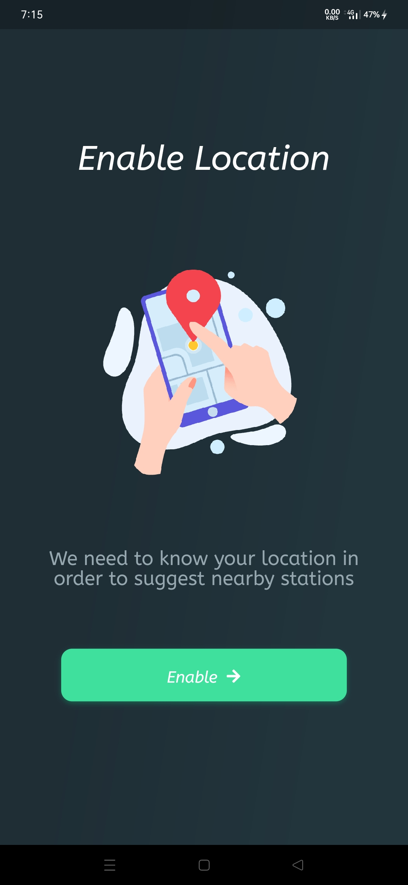

This project is an exercise project for individuals to learn Flutter.

Realize specific design effects by setting, modifying, combining self-contained widgets and customizing to meet the needs of daily development.

See the design catalog for the design drawings of this project.

## Preview 22+ Screens 📱

The effect of some pages is as follows:
|     |  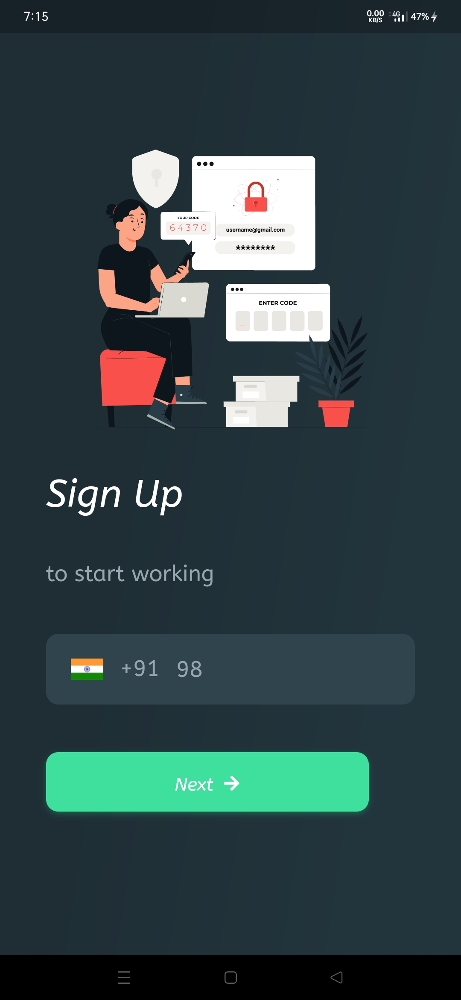    | 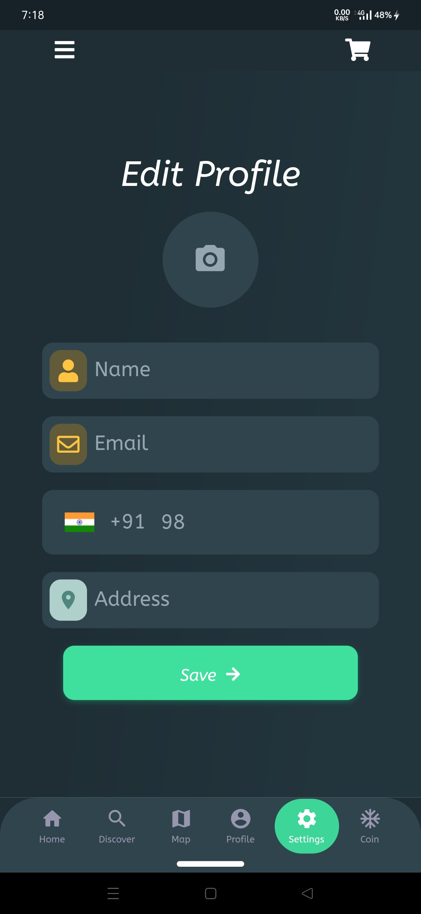   |  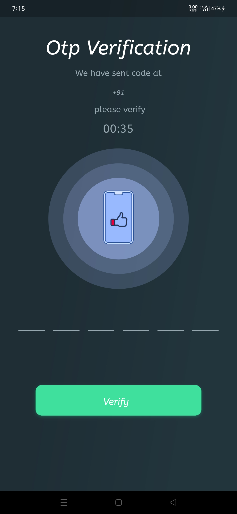   |
| :--------------------------------: | :---------------------------------: | :-------------------------------: | :-------------------------------:  |
|     |  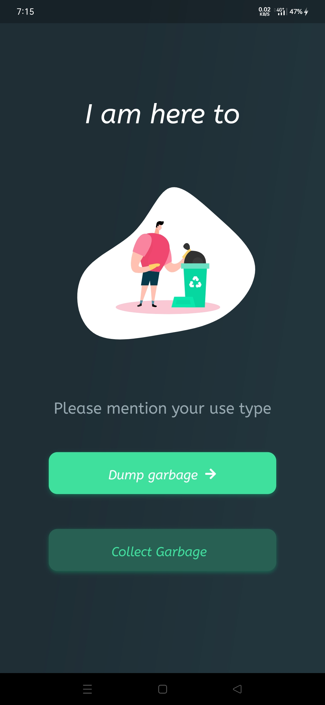    | 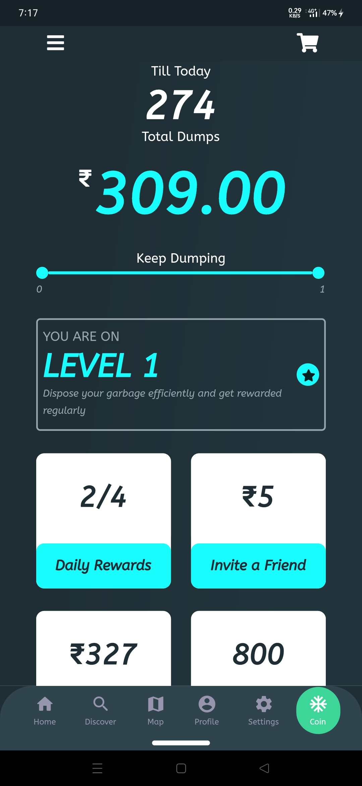   |  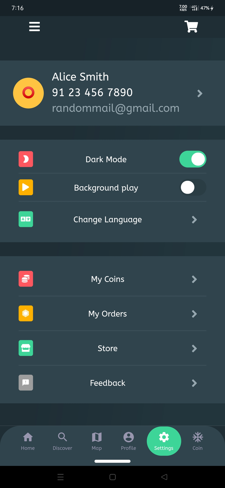   |
| 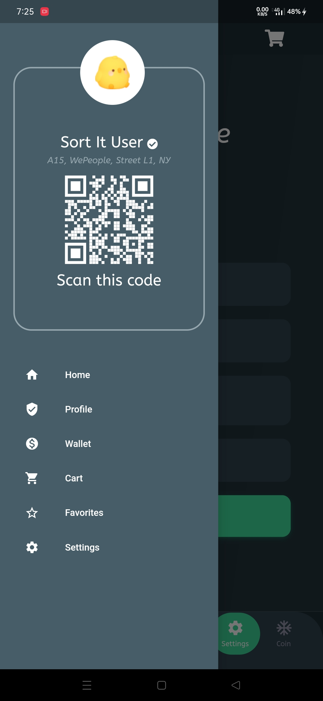    |  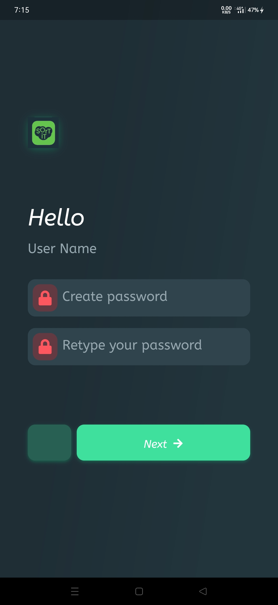   | 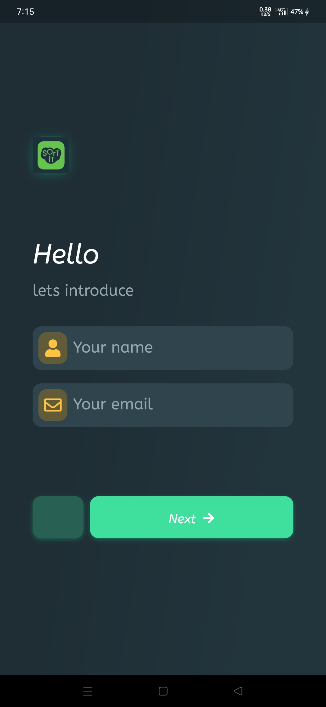  |  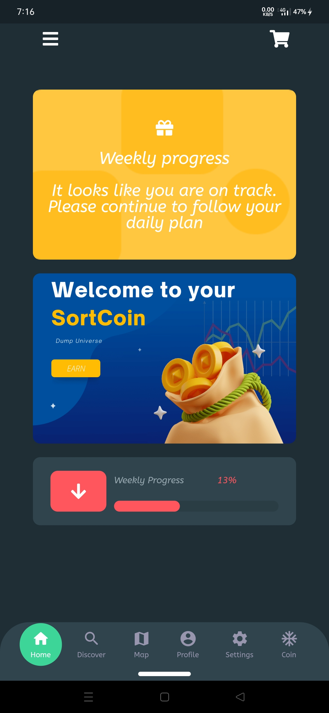  |
| 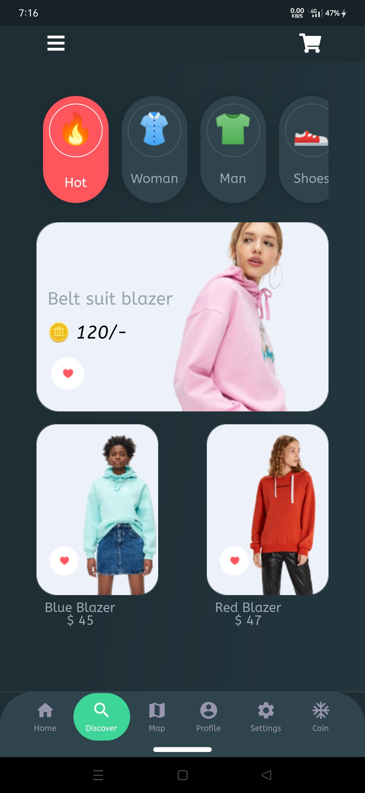   |     |   |    |
| 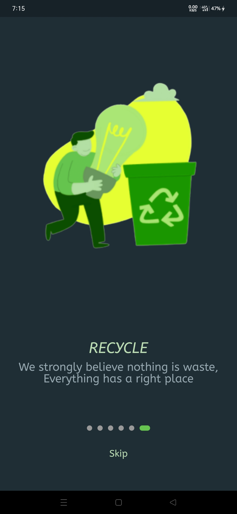   |     | 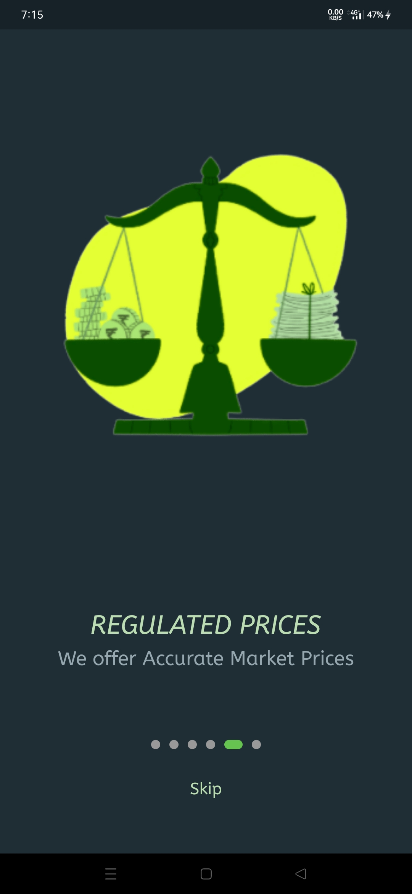  |  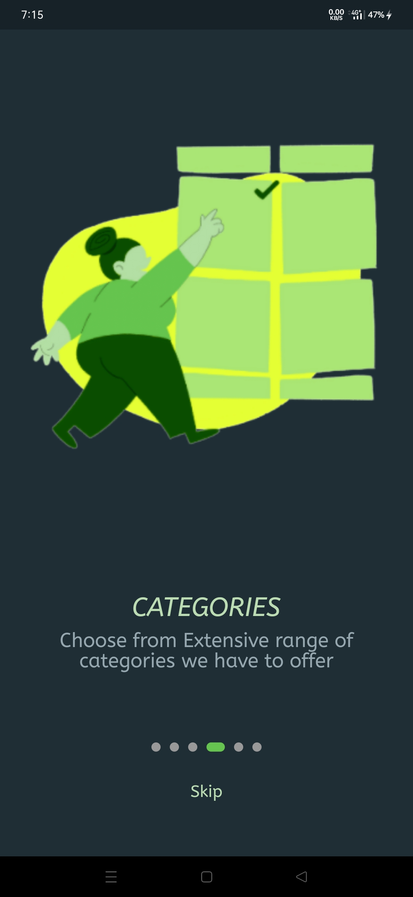  |
| 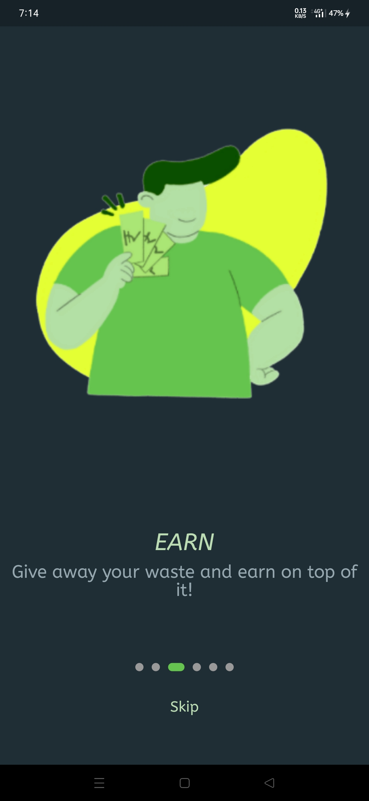   |  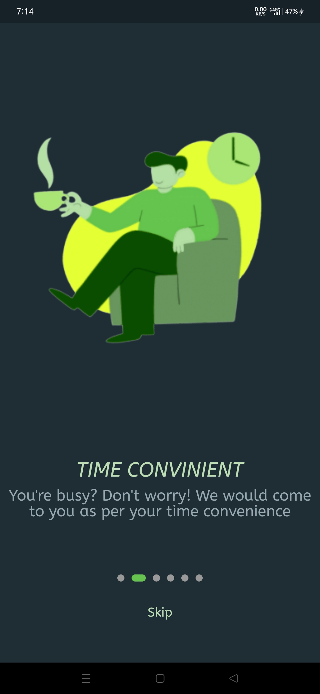   |   |    |

## Content

* mvvm architechture
* Use `getx for state management
* Network request encapsulation based on `dio` (version 4.x)
* Driver testing, accessibility testing.
* Pull down to refresh + pull up to load more
* Scan code（qr_code_scanner plugin）
* Customised Lottie Animations
* Password input keyboard
* Verification code input
* Modular routing management
* More optimization

---

 Made with ❤️ in 🇮🇳

